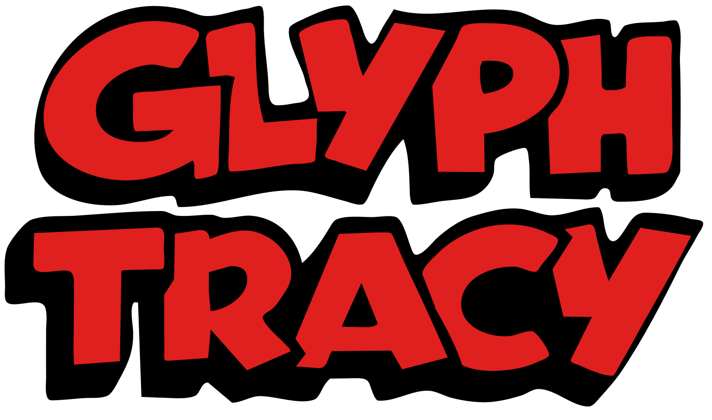

# Glyphtracy: A raster to vector conversion library



Glyphtracy is a raster to vector conversion library focused on high-quality curve fitting and node placement for font design.

This module provides the main Vectorizer class which implements the full pipeline of contour extraction, node identification, path segment creation, and curve fitting. It also includes a command-line interface for processing images and outputting SVG paths along with detailed debug information.

The Vectorizer class is highly configurable with parameters for tuning node placement sensitivity, curve fitting tolerance, and handle balancing. The output includes both the final SVG path and a structured debug payload containing details of the contours, nodes, and segments for further analysis or visualization.

Usage:

```shell
glyphtracy input_image.png --output output_image.svg --debug-json debug_output.json
```

The debug JSON file contains a detailed breakdown of the contours, nodes, and segments identified and created during the vectorization process, which can be used for debugging or visualization purposes.

A debugging viewer is available at `debugger/split_debug_viewer.html` that can load the debug JSON output and visualize the contours, nodes, and segments interactively.

Open this HTML file in a web browser, and load the generated debug_output.json to see the results of the vectorization process, including the identified nodes and fitted segments overlaid on the original contours.

Programmatic usage:

```python
from glyphtracy import Vectorizer

vectorizer = Vectorizer(
    image_source="input_image.png",
    sharp_threshold=math.radians(30),
    pixel_tolerance=1.5,
    # ... - see Vectorizer.__init__ for all parameters
)
final_path, debug_data = vectorizer.run()
# final_path is a BezPath object representing the vectorized image
# debug_data is a structured dictionary containing details of contours, nodes, and segments for debugging/visualization
```

## License

Glyphtracy is licensed under the Apache License 2.0, with the exception of the `Lib/glyphtracy/MarchingNumPy` directory which is a vendored copy of [MarchingNumPy](https://github.com/alistairboyer/MarchingNumPy) licensed under the MIT license. See the LICENSE.txt file for details.